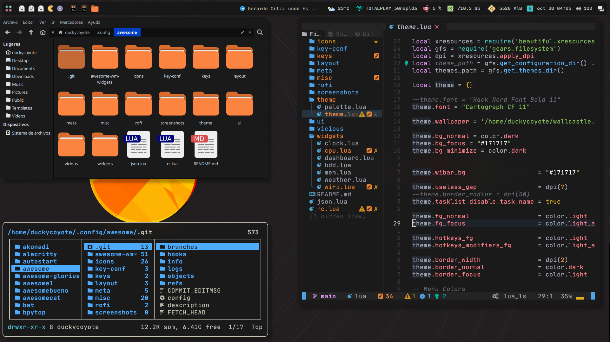

# AwesomeWM-Rice

## Setup Info

| task       | name                                        |
| ---------- | ------------------------------------------- |
| Os         | ArchLinux                                   |
| wm         |         |
| terminal   |   |
| launcher   |  |
| editor     |         |
| GtkTheme   |        |
| compositor |     |
