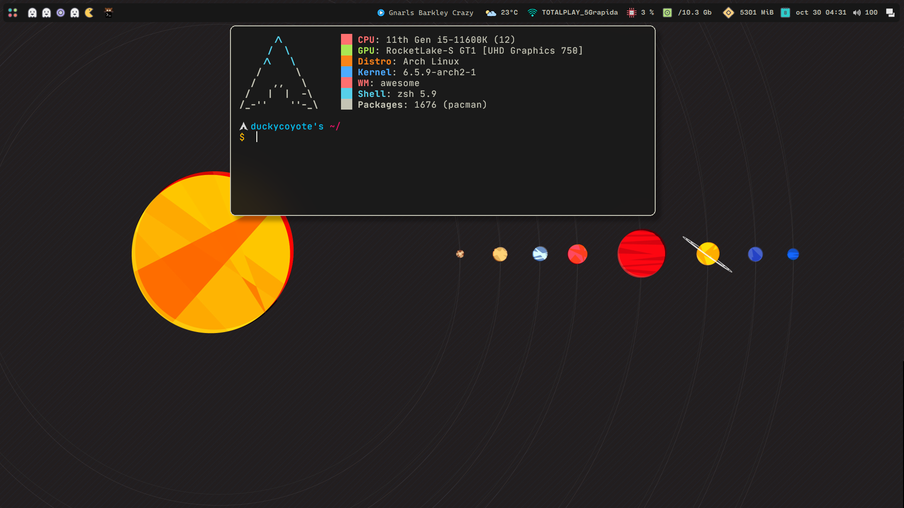
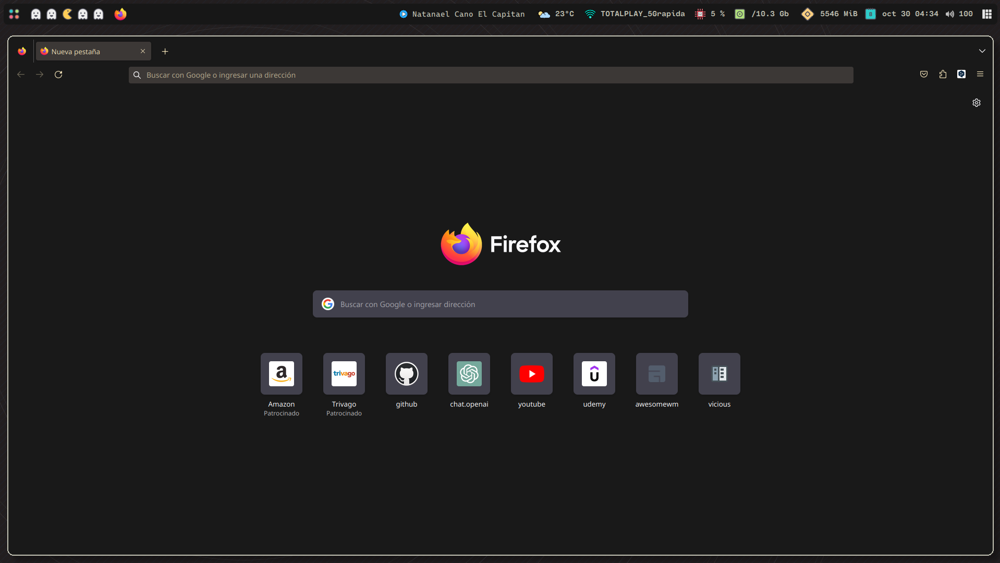
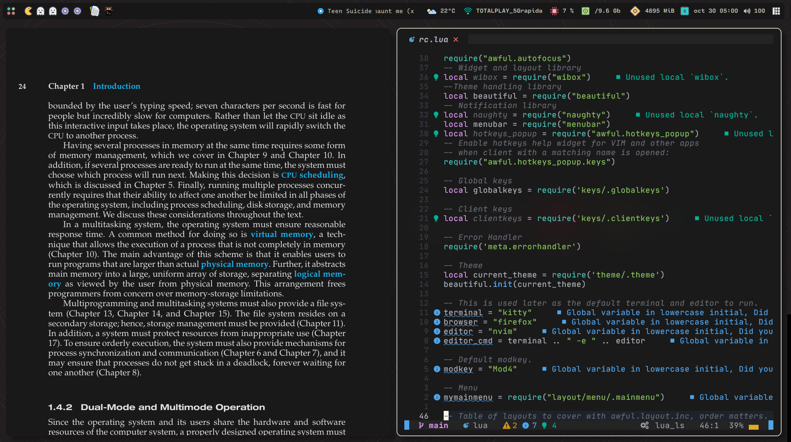

# AwesomeWM-Rice






## Acknowledgment

I dont know if this guys get this icons, wallpapers or widgets from other pearsons or fundations, but i gat this resources from his dots:

> Icons of HDD and Calendar widgets: [Nekonako dotfiles](https://github.com/nekonako/dotfiles/tree/master).

> Pacman, Ghost, Empty and dashboard icons: [gh0stzk](https://github.com/gh0stzk/dotfiles/tree/master).

> CPU Icon <a href="https://www.flaticon.com/free-icons/commerce-and-shopping" title="commerce and shopping icons">Commerce and shopping icons created by Freepik - Flaticon</a>

> WIFI ICON <a href="https://www.freepik.com/icon/wifi_1300026#fromView=resource_detail&position=9">Icon by Freepik</a>

> WIFI Icon 1 <a href="https://www.flaticon.com/free-icons/wifi" title="wifi icons">Wifi icons created by Freepik - Flaticon</a>

> WIFI, CPU, HDD, MEMORY and CALDENAR widget: [Vicious](https://vicious.readthedocs.io)

> Spotify and Weather: [awesome-wm-widgets](https://pavelmakhov.com/awesome-wm-widgets/)

> Wifi menu Rofi: [zbaylin](https://github.com/zbaylin/rofi-wifi-menu)

> Screanshots and powermenu rofi applet menu: [SapuSeven](https://github.com/SapuSeven/rofi-presets)

## Setup Info

| task        | name                                       |
| ----------- | ------------------------------------------ |
| OS          | ArchLinux                                  |
| wm          | [awesomewm-git](https://awesomewm.org)     |
| terminal    | [kitty](https://sw.kovidgoyal.net/kitty)   |
| launcher    | [Rofi](https://github.com/davatorium/rofi) |
| editor      | [AstroNvim](https://astronvim.com)         |
| GtkTheme    | [AzureTheme](https://astronvim.com)        |
| compositor  | [picom](https://github.com/yshui/picom)    |
| screenshots | Scrot                                      |

## Requirements

| Dependencies   |
| -------------- |
| PulseAudio     |
| mdp & ncmpcpp  |
| NetworkManager |
| alsa-utils     |
| lxappearance   |

### Shell

| Shell                                                           |
| --------------------------------------------------------------- |
| [zsh](https://www.zsh.org) + [Oh-My-Posh](https://ohmyposh.dev) |

### Fonts

- Global
  - Cartograph CF
- Terminal
  - JetBrainsMono Nerd Font
- Menu
  - Roboto

### Install

```zsh
sudo pacman -S mpd ncmpcpp networkmanager pulseaudio kitty rofi neovim picom alsa-utils acpi scrot zsh
yay -S lxappearance ttf-jetbrains-mono-nerd
```

## Get this rise

### Clone this repository

```zsh
git clone https://github.com/DuckyCoyote/awesomewm-rice/tree/main
```

### Copy this repository to your .config

```zsh
cd awesomewm-rice
cp -r ./* ~/.config/awesome/
cp -r ~/.config/awesome/rofi/rofi-applets ~/.config/rofi
cp -r ./misc/picom.conf ~/.config/
cp -r ./misc/fonts/Roboto ~/.local/share/fonts/Roboto
cp -r ./misc/fonts/CartographCF/ ~/.local/share/fonts/CartographCF
cp -r ./misc/fonts/clarity-city/ ~/.local/share/fonts/
cp -r ./misc/nvim ~/.config/nvim
```

Reload your awesome with `CTRL + SUPER + r` and:

```zsh
#zsh config
chsh -s /usr/bin/zsh
cp -r ./misc/.zshrc ~/.zshrc
cp -r ./misc/di4am0nd.omp.json ~/di4am0nd.omp.json
exec zsh
```

### Change the bg color of astrovim

Launch nvim and instal all the plugins, after:

```zsh
cp -r ./misc/nvim/astrothememd ~/.local/share/nvim/lazy/astrotheme
```

### Spotify widget

First you need to have spotify CLI installed, it uses dbus to communicate with spotify-client:

```zsh
git clone https://gist.github.com/fa6258f3ff7b17747ee3.git
cd ./fa6258f3ff7b17747ee3
chmod +x sp
# This widget will work by default if the binary is in the system PATH
sudo cp ./sp /usr/local/bin/
# Alternatively, you may save the binary anywhere and supply the path via this widget's sp_bin argument:
# cp ./sp ~/.config/awesome/scripts/
```

> [awesome-wm-wdgets](https://pavelmakhov.com/awesome-wm-widgets/)

## Extras

In misc is the zathura config, firefox css theme, ranger conf and some others wallpapers.
